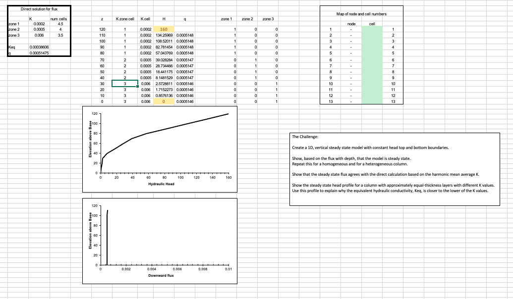
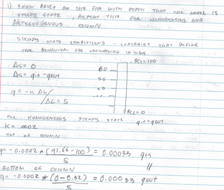
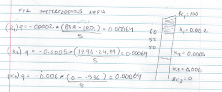
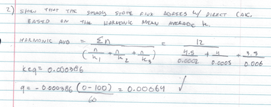

*Figure 1: Modified spreadsheet with a solution for a heterogeneous column with three layers of k values.*

*Figure 2: Modified spreadsheet with a solution for a homogeneous column.*

## Adam's answers to The Challenge
1. Show, based on the flux with depth, that the model is steady state.  Repeat this for a homogeneous and for a heterogeneous column.

2. Show that the steady state flux agrees with the direct calculation based on the harmonic mean average K.  Write the equation defining the direct calculation of the flux.

3. Show the steady state head profile for a column with approximately equal-thickness layers that have different K values.

*Figure 1: Modified spreadsheet with a solution for a heterogeneous column with three layers of k values.*

4. Use the head profile to explain WHY the equivalent hydraulic conductivity, Keq, is closer to the lower of the two K values.

Dividing an integer by smaller values (0.0002) in this case yields a larger value compared to dividing by a larger value (0.006). Because of this the smaller K value influences the overall Keq value more. Smaller k values lead to larger flux in total head.

## Discussion Points
*In addition to The Challenge, start thinking about the following ideas:*
1. What are boundary conditions?  Answer this both conceptually and mathematically.

Boundary conditions can be thought of conceptually as the bounds of a system - a basketball court or lines on a tennis court define the bounds of these games. In mathmatics boundaries are necessary for a solution to a problem. They also can be based on the physics that the problem is being solved for.

2. What are model parameters?  How do they (and don't they) represent the actual subsurface?

Model parameters are using defined values for inputs into the model. This is a simplilified 1D model of subsurface flow, when in reality there are three dimensions, we are also not considering thermodynamics or geochemistry when inputing parameters into this model.

3. What are steady state conditions and how can they be identified from the Excel model results?

Steady state conditions are when the change in storage does not change. This does not mean that the flux is zero, only that the value in = value out.  Conservation of mass is observed. We can see this in the excel by observing qin - qout = 0 = no change in storage.

4. Can you imagine how the model inputs could be stored in separate files rather than other spreadsheet cells?  Describe the flow of information from a file that describes the other files that contain model-specific information about the system.

By codifying the parameters we can automate the process. First write out the governing equations and model inputs. Define the variables, write a code to step through the formulas with a for loop and define conditions for terminating the code.

1. What is an iterative solution?  Can you explain it to a hydrologist who is not a modeler?  Can you describe (or imagine) how Excel finds the solution?

Iteration is a process by which we can  approach an approximation of something given an initial starting point. This can be applied to both linear and nonlinear problems. The process (equation) is carried out many many times and can give an approximation.

1. What is a direct solution?  What are its (dis)advantages compared to an iterative (numerical) solution?

A direct solution gives one finite solution whereas iteration gives an ensemble of solutions providing an approximation to a solution. In the field of hydrology, given that it is an imprecise science, the disadvantages to a direct solution can provide a false confidence that there is a deterministic, reductionist solution to a problem. Numerical solutions can give insight into a range of possible solutions.